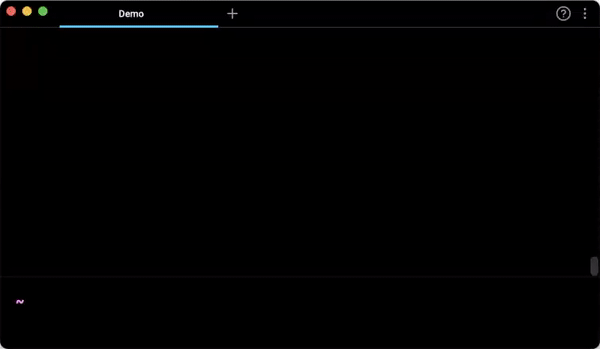
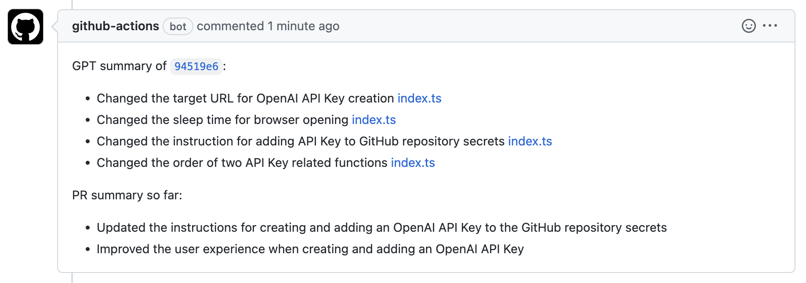

# Add GPT Summarizer


an `npx` command to add the [`KanHarI/gpt-commit-summarizer`][action] GitHub Action to your repository.



This is how it will look in your pull-requests:



## Usage

```bash
npx add-gpt-summarizer@latest
```


```bash
$ npx add-gpt-summarizer@latest --help
    Add AI powered summarization to your PR in your codebase
    
    Options:
          --help                                Show help                  [boolean]
          --version                             Show version number        [boolean]
      -y, --yes, --non-interactive, --nonInter  Skip the prompts and use the default
      active                                     values   [boolean] [default: false]
      -a, --action-name, --actionName           Name of the GitHub Action
                                         [string] [default: "gpt-commit-summarizer"]
      -s, --self-hosted, --selfHosted           Use self-hosted runners
                                                          [boolean] [default: false]
      -n, --no-browser, --noBrowser             Do not open the browser to create an
                                                 OpenAI API Key
                                                          [boolean] [default: false]
      -c, --commit                              Commit the changes to the repository
                                                           [boolean] [default: true]
      -p, --push                                Push the changes to the repository
                                                          [boolean] [default: false]
      -d, --dry-run, --dryRun                   Do not commit or push the changes to
                                                 the repository
                                                          [boolean] [default: false]
```

## License

MIT. See [LICENSE](./LICENSE) for more details.

# Acknowledgements

Thanks to [KanHarI][KanHarI] for creating the 
[gpt-commit-summarizer][action] GitHub Action.

[KanHarI]: https://github.com/KanHarI
[action]: https://github.com/KanHarI/gpt-commit-summarizer
